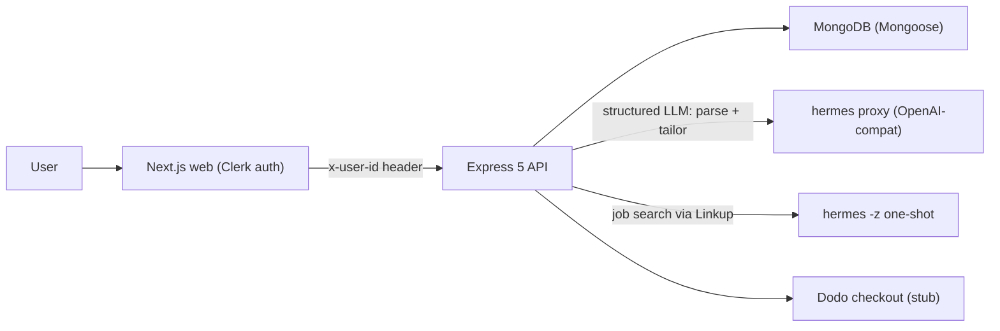

# Career Accelerator MVP (3-Hour Buildathon)

## Reality check (grounded in current repo)
- The API **does not boot today**: [apps/api/src/config/env.ts](apps/api/src/config/env.ts) requires `MONGODB_URI` + `OPENAI_API_KEY`, but root `.env` only has `DATABASE_URL`. Fix env first.
- Standardize on **MongoDB + Mongoose** (docker-compose, `.env.example`, and `package.json` already match). Ignore the stray `@prisma/client` in node_modules.
- API has only `GET /health` ([apps/api/src/routes/index.ts](apps/api/src/routes/index.ts)); no models, no `/profiles`. Web [apps/web/src/app/page.tsx](apps/web/src/app/page.tsx) calls a non-existent `/profiles`.
- **Hermes** is a global CLI (v0.18.0). Two hooks we use:
  - `hermes proxy start` -> OpenAI-compatible HTTP endpoint. Point the installed `openai` SDK `baseURL` at it for structured LLM calls (resume parse, tailoring). Keeps AI "on the Hermes harness."
  - `hermes -z "<prompt>"` (one-shot, child_process) -> agentic tasks that need **Linkup web search** for live jobs.
- No Clerk / Linkup / Dodo code exists -> all greenfield.

## Architecture

## Critical path (thin vertical slice)
Sign in -> ingest resume -> see ranked jobs -> click job -> one-click tailored resume. Everything else (payments, analytics, PDF parsing) is secondary and must not block this flow.

## Backend (`apps/api`)
- **Env fix**: add `MONGODB_URI`, `OPENAI_API_KEY` (dummy bearer for proxy), `OPENAI_BASE_URL`, `LINKUP_API_KEY`, `CLERK_SECRET_KEY`, `DODO_API_KEY` to `.env` and [apps/api/src/config/env.ts](apps/api/src/config/env.ts). Update `.env.example`.
- **AI client**: point [apps/api/src/agents/config/openai.config.ts](apps/api/src/agents/config/openai.config.ts) `baseURL` at the Hermes proxy. Add `src/services/hermes.ts` with `runHermesTask(prompt)` (spawns `hermes -z`, parses JSON) for Linkup job search.
- **Mongoose models** in `apps/api/src/models/`: `User` (clerkId, email, name, plan), `Profile` (userId, rawResumeText, linkedinUrl, parsed{title,years,skills[],industries[],preferredRoles[],preferredLocations[],summary}), `Job` (source, externalId, title, company, location, mode, description, applyUrl, tags[]), `TailoredResume` (userId, jobId, headline, summary, bullets[], keywordGaps[], matchScore).
- **Routes** (register in [apps/api/src/routes/index.ts](apps/api/src/routes/index.ts), one file per resource):
  - `POST /profile/ingest` -> parse resume/summary via Hermes proxy (strict JSON), upsert Profile.
  - `GET /profile/:clerkId`.
  - `GET /jobs?query=&location=` -> `hermes -z` Linkup search, upsert Jobs; on any failure fall back to seeded jobs.
  - `GET /recommendations/:clerkId` -> deterministic score (skills Jaccard 45%, title overlap 25%, location/mode 15%, years fit 15%) + "why match" + missing keywords.
  - `POST /tailor` `{clerkId, jobId}` -> Hermes proxy prompt returns `{headline, summary, bullets[], keywordsToAdd[]}`; persist. Rule-based fallback if AI errors.
  - `POST /billing/checkout` -> Dodo **stub** returning a mock checkout URL + flips `plan` optimistically.
- **Seed script** `apps/api/src/seed.ts`: ~15 curated jobs across SWE/PM/Data so demo always has content.
- **Auth**: read `x-user-id` (Clerk id) header; for pilot, trust it (optional `@clerk/backend` verify if time).

## Frontend (`apps/web`)
- **Clerk**: install `@clerk/nextjs`, wrap [apps/web/src/app/layout.tsx](apps/web/src/app/layout.tsx) in `ClerkProvider`, add `apps/web/src/middleware.ts`, `sign-in`/`sign-up` catch-all routes.
- **Pages**:
  - Rework [apps/web/src/app/page.tsx](apps/web/src/app/page.tsx) -> product landing + CTA (keep dark slate/violet `brand` theme).
  - `app/onboarding/page.tsx` -> resume paste (PDF upload optional/deferred), LinkedIn URL, target role/location/mode -> calls `/profile/ingest`.
  - `app/dashboard/page.tsx` -> ranked job cards (match score, why-match, missing keywords).
  - `app/jobs/[jobId]/page.tsx` -> job detail + "Tailor Resume" (one click) + "Apply" (applyUrl) + "Unlock Pro" (Dodo stub).
- **Lib**: `apps/web/src/lib/api.ts` typed fetchers (send `x-user-id`); extend [apps/web/src/lib/types.ts](apps/web/src/lib/types.ts) with Job/Recommendation/TailoredResume.
- **Components**: `ResumeIntakeForm`, `JobCard`, `MatchReasons`, `TailorPanel`, `ProGate`.

## Startup order (for demo)
1. `pnpm run db:up` (Mongo) 2. `hermes proxy start` (note base URL) 3. `pnpm --dir apps/api ... seed` 4. `pnpm run dev`.

## Team split (3 people, parallel)
- **A - Backend/AI**: env fix, models, Hermes proxy + `hermes -z` wiring, ingest/tailor routes, seed.
- **B - Frontend**: Clerk, landing/onboarding/dashboard/job pages, api.ts, components.
- **C - Integrations/QA**: Linkup job search + fallback, recommendation scoring, Dodo stub, E2E dry-run + seed users.

## 3-hour timeline
- 0:00-0:25 Env fix + scope freeze + API contracts; A gets Mongo+proxy healthy, B installs Clerk.
- 0:25-1:15 Models + ingest/jobs/recs routes; onboarding + dashboard pages against contracts.
- 1:15-2:10 Wire tailor flow end-to-end; Linkup search + fallback; job detail + TailorPanel.
- 2:10-2:40 Dodo stub, recommendation scoring polish, error/fallback states.
- 2:40-3:00 E2E dry run (2-3 seeded users), `pnpm run lint && pnpm run build`, demo rehearsal.

## Acceptance
- User signs in, ingests resume, sees >=10 ranked jobs with match scores, one-click tailored resume returns in demo, Apply opens URL, Pro button triggers Dodo stub. All AI observably via Hermes.

## Explicit shortcuts (per AGENTS.md sprint rules)
- Trust `x-user-id` (no full JWT verify), Dodo stubbed, PDF parsing deferred (text paste), LinkedIn = URL + manual summary (no scraping), recommendations computed on the fly (not persisted).