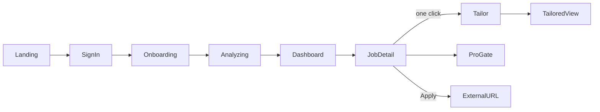

# Career Accelerator - UX & Design Plan

Dark slate + violet theme, spec-first (build coded UI directly). Mobbin MCP is not connected; inspiration is drawn from category leaders (Teal, Otta, Rezi, Simplify, LinkedIn). Figma MCP is available as an optional parallel track.

## 1. Design principles
- **One primary action per screen.** The user should never wonder what to do next.
- **Progressive disclosure.** Ask only what's needed to unlock value; defer detail.
- **Show the "why."** Every match and tailor edit is explained (builds trust in AI).
- **Never dead-end.** Loading, empty, error, and fallback states are first-class.
- **Speed feels magical.** Optimistic UI + skeletons so AI latency feels instant.

## 2. Visual language (extends existing tokens)
- Base: `bg-slate-950`, text `slate-100/300`, cards `.card` (rounded-2xl, `border-slate-700/70`, `bg-slate-900/60`, shadow-xl) - already in [apps/web/src/app/globals.css](apps/web/src/app/globals.css).
- Accent: `brand` violet scale from [apps/web/tailwind.config.ts](apps/web/tailwind.config.ts) (`500 #8b5cf6`, `600 #7c3aed`) for primary CTAs, active states, match highlights.
- Semantic colors: match score = emerald (high) / amber (mid) / slate (low); gaps/warnings = amber; Pro = violet gradient.
- Type scale: display 36-48 (landing), h1 28, h2 20, body 15-16, caption 13. Tight tracking on headings.
- Radius 16 (cards) / 12 (inputs, chips) / 999 (pills). Consistent 4/8/12/16/24 spacing rhythm.
- Add utilities to globals.css: `.btn-primary`, `.btn-ghost`, `.chip`, `.skeleton` (shimmer), `.gradient-brand`.

## 3. Reusable components (`apps/web/src/components/`)
- `AppShell` (top nav: logo, "Matches", profile menu/Clerk `UserButton`), `PageHeader`, `Button`, `Chip/Tag`, `Card`, `ScoreRing` (circular match %), `SkillPill`, `Skeleton`, `EmptyState`, `Toast`.
- Flow-specific: `ResumeIntakeForm`, `AnalyzingState`, `JobCard`, `MatchReasons`, `TailorPanel`, `TailoredResumeView`, `ProGate`.

## 4. End-to-end flow

## 5. Screen-by-screen spec

### Landing ([apps/web/src/app/page.tsx](apps/web/src/app/page.tsx) rework)
- Hero: headline "Get matched to jobs and tailor your resume in one click", subcopy, single primary CTA "Get started free" -> sign-in. Secondary "See how it works".
- Below-fold: 3-step visual (Add resume -> Get matches -> Tailor & apply), trust strip. Keep it to one screen of real content; no clutter.

### Auth (Clerk)
- Use Clerk's hosted `<SignIn/>`/`<SignUp/>` themed to dark (violet primary). Minimal friction: email + Google. After sign-in, route to `/onboarding` if no profile, else `/dashboard`.

### Onboarding / resume intake (`app/onboarding`)
- Single centered card, generous whitespace. Segmented input: "Paste resume text" (default) | "LinkedIn URL" | "Quick summary" (fallback). PDF upload shown but marked optional.
- Below: target role, location, work mode (chips: Remote/Hybrid/Onsite). One primary CTA "Analyze my profile".
- Inline validation, no hard blocks (manual summary always lets them proceed).

### Analyzing state (transition, not a separate route)
- Full-card animated state: staged status lines ("Reading your experience... Extracting skills... Finding matches...") with skeleton job cards behind. Makes 3-8s AI latency feel intentional. Falls through to Dashboard.

### Dashboard / recommendations (`app/dashboard`)
- Left: sticky profile summary (parsed title, top skills as pills, edit link). Right: ranked `JobCard` list.
- `JobCard`: title + company + location/mode, `ScoreRing` match %, top-3 `MatchReasons` (skill overlap), 1-2 "missing keywords" chips in amber, actions "View" / "Tailor". Sort by match; simple filter chips (role, mode).
- States: skeletons while loading, `EmptyState` if no profile, subtle "Showing curated jobs" banner when Linkup fallback is used.

### Job detail + tailor (`app/jobs/[jobId]`)
- Two-column: left = job description + requirements (matched skills highlighted green, gaps amber); right = sticky action rail with big **"Tailor my resume"** (one click), "Apply" (opens applyUrl), and `ProGate` for premium.
- Clicking Tailor opens `TailorPanel` (slide-over) with optimistic skeleton, then `TailoredResumeView`: tailored headline, summary, 5-8 bullets, "keywords to add" chips, Copy + Download buttons. Show a diff-style "what changed & why" note.

### Pro paywall (Dodo stub)
- `ProGate` card: free = 1-2 tailors, Pro = unlimited + export. CTA "Upgrade" -> Dodo stub checkout (mock URL), optimistic unlock on return. Keep non-blocking for demo.

### Global states
- Toasts for success/copy/errors; consistent `EmptyState` and error cards ("Backend unavailable" pattern already in page.tsx); every AI action has skeleton + graceful fallback text.

## 6. Motion & microinteractions
- 150-200ms ease-out on hovers/press; card lift on hover; ScoreRing animates 0->value on mount; slide-over spring for TailorPanel; staged fade-in for analyzing lines. Respect `prefers-reduced-motion`.

## 7. Accessibility & responsive
- WCAG AA contrast on dark bg (use slate-100/300, avoid slate-500 for body). Focus rings (violet). Keyboard-navigable cards/slide-over, ARIA labels on ScoreRing/icons. Mobile: single column, sticky bottom action bar on job detail, collapsible profile summary.

## 8. Inspiration references (Mobbin unavailable)
- Teal (resume tailoring + match score UX), Otta (opinionated job cards + reasons), Rezi/Kickresume (resume editing + keyword gaps), Simplify (one-click apply rail), LinkedIn (skill pills). Use as pattern references, not visual copies.

## 9. Optional Figma track (parallel, if time)
- Figma MCP is connected: on execution we can `search_design_system` then `use_figma`/`generate_figma_design` to produce mockups of Landing, Onboarding, Dashboard, Job detail. Not on the critical path - coded UI is the source of truth for the 3h build. paper.design is a fine lightweight alternative for a quick wireframe if desired.

## 10. Design -> build mapping
- New utilities in globals.css; shared components in `apps/web/src/components/`; screens in `app/onboarding`, `app/dashboard`, `app/jobs/[jobId]`, plus landing rework. All consume `lib/api.ts` typed data from the build plan. No new design dependencies required (pure Tailwind + existing tokens).